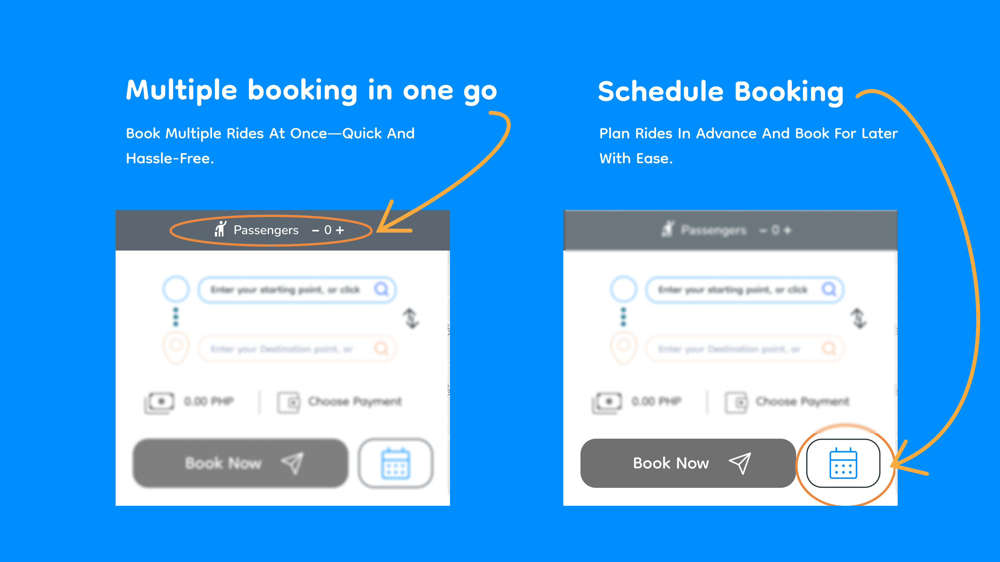

# Angkas

Case Study Description: Angkas App Redesign Concept (User-Based)
Timeline: August 1, 2022 → September 29, 2022

# Project Overview 👓

This concept redesign explores how the Angkas app can be faster and more efficient by reducing friction in booking, route entry, and voucher application. I simplified flows, minimized transitions, and improved responsiveness while preserving the existing brand identity. This was an independent solo project. 

# Problem

During regular use, several friction points became clear:

- Slow animations and transitions delayed access to booking
- Multiple steps were required to enter routes and apply vouchers
- Extra taps increased time to complete time sensitive tasks

<aside>
👉

These issues slowed down ride requests and reduced efficiency in situations where speed matters most.

</aside>

# Solution

To address these issues, I focused on simplifying and speeding up the core booking flow:

- Reduced or removed non-essential animations to shorten waiting time
- Combined route entry and voucher application into fewer steps
- Reduced the number of taps required to request a ride
- Prioritized essential services on the home screen for quicker access
- Preserved the existing color scheme and typography for brand consistency

<aside>
👉

These changes aimed to create a faster and more direct booking experience without altering the familiar look of the app.

</aside>

.png)

---

# Process

How I approached the redesign:

- Conducted a heuristic review to identify friction points and unnecessary steps
- Mapped the existing booking flow and counted interactions required to request a ride
- Simplified flows by reducing transitions and combining related actions
- Created sketches and wireframes to explore faster task completion
- Built interactive prototypes to test navigation speed and usability
- Iterated through self testing and edge cases

<aside>
👉

This structured approach helped me focus on reducing effort and improving responsiveness while keeping the overall experience familiar.

</aside>

## Sketches

I sketched early concepts to quickly explore layout options and reduce steps in the booking flow before committing to wireframes.

## Wireframes & Prototypes

I created low fidelity wireframes to define structure and simplify navigation. Interactive prototypes allowed me to test task completion speed, transitions, and edge cases before moving to high fidelity designs.

---

# **Final Design**

<aside>
👇

**Click to play with the prototype**

</aside>

[https://www.figma.com/proto/fsxMk1XgYf1UPaWUBiMHyh/ANGKAS---Redesign?page-id=50%3A485&node-id=1199-14175&node-type=frame&viewport=4147%2C3009%2C0.52&t=ftzzPFslgHVZr5vA-1&scaling=scale-down&content-scaling=fixed&starting-point-node-id=1199%3A14175&show-proto-sidebar=1](https://www.figma.com/proto/fsxMk1XgYf1UPaWUBiMHyh/ANGKAS---Redesign?page-id=50%3A485&node-id=1199-14175&node-type=frame&viewport=4147%2C3009%2C0.52&t=ftzzPFslgHVZr5vA-1&scaling=scale-down&content-scaling=fixed&starting-point-node-id=1199%3A14175&show-proto-sidebar=1)

# **Product Success** 👏

This redesign demonstrates how reducing steps, minimizing transitions, and simplifying interactions can create a faster and more direct booking experience. By focusing on performance and clarity, the flow requires less effort and helps users complete tasks more quickly while preserving the familiar brand identity.

# **What I Learned** 🌱

This project reinforced that small interaction costs add up quickly in time sensitive apps. Reducing steps and transitions often has more impact than adding features. It also taught me to balance efficiency with familiarity, improving speed without disrupting the brand experience.

[Back to the Top](https://www.notion.so/Angkas-13c92dc95d5280e595d3efc6b5a775a5?pvs=21)